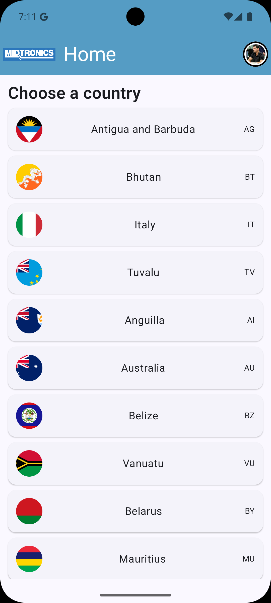
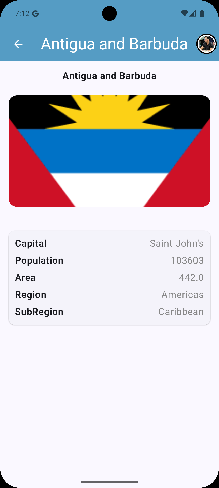
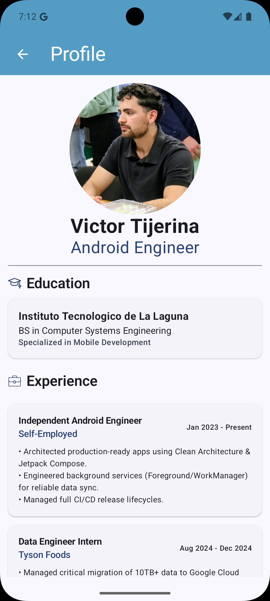

# MidtronicsTest
A sample Android application demonstrating my knowledge of Android development.
The app consumes a REST API to display a list of countries, view details for a specific country, and includes a developer profile screen showing relevant information.

# Features

* **Country List:** Fetches and displays data from a remote API.
* **Country Detail:** Navigation to a detailed view with more information, passing parameters via navigation.
* **Developer Profile:** A static screen showcasing my background and experience.

# Stack

* **Kotlin**
* **Jetpack Compose** for UI.
* **Hilt** for Dependency Injection.
* **Retrofit** for network requests.
* **Coroutines & Flow** for asynchronous operations.
* **Coil** for image loading.

# Architecture
This project follows a Clean Architecture approach using MVVM, organizing files into their respective packages (data and presentation).

# Details
* **Repository Pattern:** Acts as the single source of truth for data.
* **Async Handling:** All network calls are performed on the IO dispatcher to prevent UI freezing.
* **State Management:** ViewModels expose a single UI State object to the UI.

# Images
| Country List | Detail View | Profile Screen |
|:---:|:---:|:---:|
|  |  |  |

# Run
To run the app, you can either download and extract the ZIP file containing the project or clone the repository. Once done, simply open the project in Android Studio and run it.
